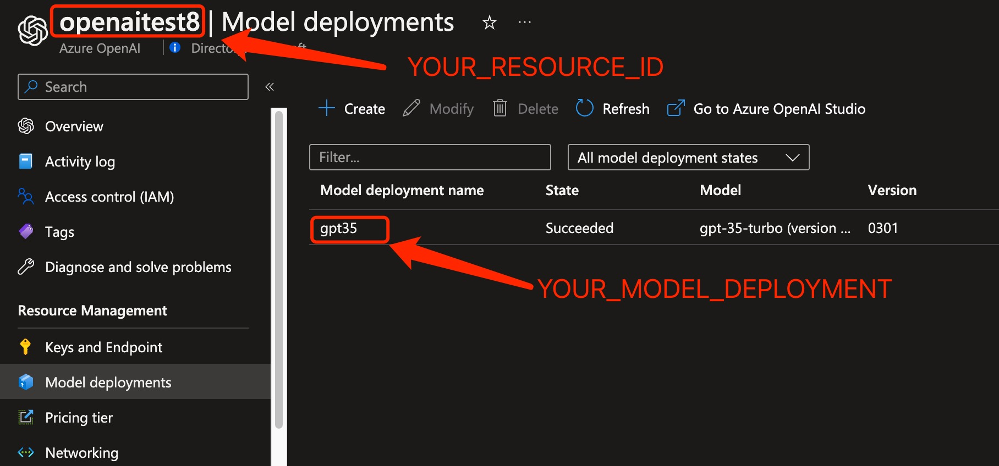

# 项目基于Azure OpenAI Proxy
- 在Azure OpenAI Proxy的基础上加了embedding的支持
- openai支持多input，且用数组形式传递，azure只支持一个，所以用\n分割组成一个
- openai支持input最大8192个token，azure只支持一2048个token
- 在Azure部署的时候需要按规则部署
> 比如聊天模型3.5的部署的名称是“test”，需要部署的其他模型是“text-embedding-ada-002”，那么在其他模型部署的时候名称直接使用“test-text-embedding-ada-002”,这样就可以无缝兼容openai

```
${deploymentId}-${body['model']}
```
- 其他内容请直接查看[Azure OpenAI Proxy](https://github.com/scalaone/azure-openai-proxy)

# Azure OpenAI Proxy

[English](./README.en-US.md) | 简体中文

一个 Azure OpenAI API 代理工具，能将 OpenAI API 请求转换为 Azure OpenAI API 请求，使仅支持 OpenAI 的应用程序可以无缝地使用 Azure Open AI。

## 使用要求

必须拥有Azure OpenAI帐户才能使用 Azure OpenAI Proxy。


## 本地运行和测试，命令行方式

1. 安装 NodeJS 18。
2. 克隆代码到命令行窗口。
3. 运行 `npm install` 安装依赖项。
4. 运行 `npm run build` 然后 `npm run start` 启动应用程序。或者直接  `npm run start:dev`
5. 运行下面脚本测试，运行前需要把`YOUR_RESOURCE_ID`，`YOUR_MODEL_DEPLOYMENT`，`YOUR_API_KEY`, `AZURE_API_VERSION`替换，`AZURE_API_VERSION`参数可选，目前默认是2023-03-15-preview。
```bash
curl -X "POST" "http://localhost:3000/v1/chat/completions" \
-H 'Authorization: YOUR_RESOURCE_ID:YOUR_MODEL_DEPLOYMENT:YOUR_API_KEY:AZURE_API_VERSION' \
-H 'Content-Type: application/json; charset=utf-8' \
-d $'{
  "messages": [
    {
      "role": "system",
      "content": "You are an AI assistant that helps people find information."
    },
    {
      "role": "user",
      "content": "hi."
    }
  ],
  "temperature": 1,
  "model": "gpt-3.5-turbo",
  "stream": false
}'
```

## 已测试应用

以下应用已经过测试，确认可以与 azure-openai-proxy 一起工作：

| App Name         | E2E Docker-compose file | 
|------------------|-------------------------|
| [chatbot-ui](https://github.com/mckaywrigley/chatbot-ui) | [docker-compose.yml](./e2e/chatbot-ui/docker-compose.yml) |
| [chatgpt-web](https://github.com/Chanzhaoyu/chatgpt-web) | [docker-compose.yml](./e2e/chatgpt-web/docker-compose.yml) |
| [gptlite](https://github.com/blrchen/gptlite)  | [docker-compose.yml](./e2e/gptlite/docker-compose.yml) |

要在本地运行测试，请按照以下步骤操作：

1. 在命令行窗口中克隆代码。
2. 更新环境变量`OPENAPI_API_KEY`的值为`YOUR_RESOURCE_ID:YOUR_MODEL_DEPLOYMENT:YOUR_API_KEY`。或者，直接在`docker-compose.yml`文件中更新`OPENAPI_API_KEY`值。
3. 导航到包含要测试的应用程序的`docker-compose.yml`文件所在的目录。
3. 执行构建命令：`docker-compose build`。
4. 启动服务：`docker-compose up -d`。
5. 根据`docker-compose.yml`文件中定义的公开端口，启动应用以在本地进行测试。例如，访问 http://localhost:3000。

## 常见问题

Q：什么是`YOUR_RESOURCE_ID`，`YOUR_MODEL_DEPLOYMENT`，`YOUR_API_KEY`

A: 可以在Azure的管理门户里查找，具体见下图标注



Q: 如何支持GPT-4

A: 要使用GPT-4，请使用下列格式的key: 

`YOUR_RESOURCE_ID:gpt-3.5-turbo|YOUR_MODEL_DEPLOYMENT,gpt-4|YOUR_MODEL_DEPLOYMENT,gpt-4-32k|YOUR_MODEL_DEPLOYMENT:YOUR_API_KEY:AZURE_API_VERSION`

# 贡献代码方式

欢迎提交各种PR。

# 免责声明

此代码仅供演示和测试目的。